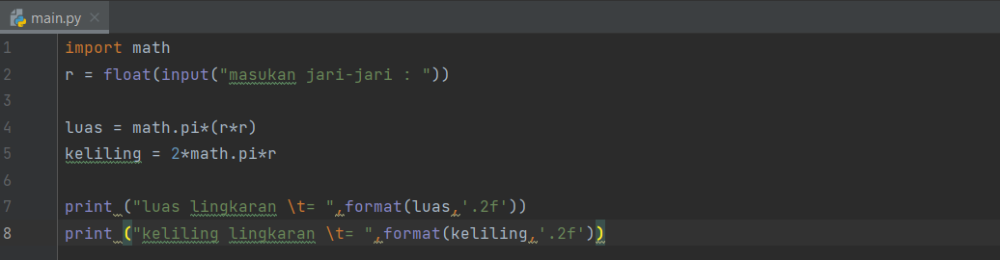
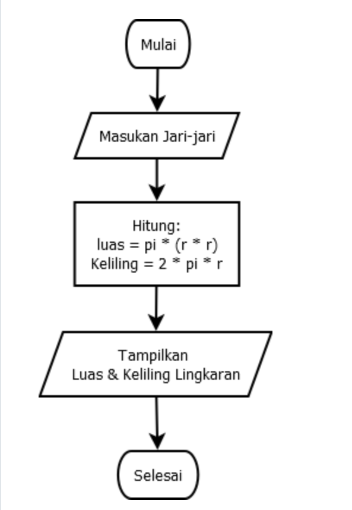

#praktikum3

# menghitung luas & keliling lingkaran pada python

# python meghitung luas & keliling lingkaran

# source kode

Berikut ini adalah Code Program untuk Menghitung Luas Lingkaran dan Keliling Lingkaran dalam bahasa pemrograman Python:

# Output (Hasil Runnig Program)

Berikut ini adalah hasil running program untuk menghitung luas Lingkaran dan Keliling Lingkaran dalam bahasa pemrograman Python:

# Flowchart menghitung luas & keliling lingkaran

Penjelasan Algoritma Menghitung Luas dan Keliling Lingkaran sebagai berikut:

1. Mulai
2. Masukan Jari-Jari
3. Proses hitung Luas (L) dan Keliling (K) Lingkaran
4. Tampilkan Luas (L) dan Keliling (K) Lingkaran
5. Selesai

